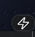

# ⚡ Nook

[](https://github.com/XandeBritez/Nook)
[](https://dotnet.microsoft.com/download)
[](./LICENSE)

**Seu cantinho na tela.** O Nook é um cartão flutuante que mora no canto do monitor com seus atalhos, monitor do PC, pomodoro, histórico da área de transferência e turbo — tudo sem pedir permissão de administrador. Passe o mouse e ele abre; tire o mouse e ele some.



## ✨ Recursos

- **Botões do seu jeito** — arraste `.exe`/`.lnk`/`.bat` para cima do cartão e vira botão; editor visual com nome, ícone (emoji), tooltip e ações embutidas.
- **4 modos de grade** — 1 coluna (ícone + nome), 2 colunas (só ícones), **1x** e **2x paginados** com setas ◀ ▶ (8 ou 16 por página).
- **📸 Print → Paint** — captura todas as telas em PNG e abre direto no Paint.
- **📋 Clips** — histórico dos últimos 25 textos copiados, com busca (opcional: manter ao sair).
- **🍅 Pomodoro** — foco/pausa configuráveis, com aviso no tray e som.
- **🚀 Turbo** — encerra helpers e compacta a RAM (pede confirmação).
- **📊 Monitor** — CPU e RAM ao vivo no rodapé.
- **Atalho global** (padrão `Ctrl+Alt+H`), **autostart** com o Windows, temas claro/escuro, 3 tamanhos, 4 cantos e opacidade ajustável.

## 🚀 Instalação

1. Instale o **[.NET 10 Desktop Runtime (x64)](https://dotnet.microsoft.com/download/dotnet/10.0)** — o Nook é leve de propósito e usa o runtime instalado.
2. Baixe a pasta `Nook/publish` (ou rode `.\publish.ps1` a partir do código-fonte).
3. Execute `Nook.exe`. Para iniciar com o Windows, marque **Iniciar com o Windows** no menu do tray.
4. Vindo do nome antigo (HubApp)? O Nook **migra sozinho** seus botões e configurações na primeira execução.

## 🖱️ Uso

| Ação | Como |
|---|---|
| Abrir o cartão | Passe o mouse no ⚡, ou `Ctrl+Alt+H`, ou duplo-clique no tray |
| Fixar aberto | 📌 no topo do cartão |
| Editar botões | ⚙️ no topo do cartão (ou menu do tray) |
| Adicionar programa | Arraste o `.exe`/atalho para cima do cartão |
| Paginar (modos 1x/2x) | Clique em ◀ ▶ abaixo do botão Sair |
| Sobre / versão / licença | Aba **Sobre** nas configurações (ou menu do tray) |

### Ações embutidas

Bloquear o PC • Mudo • Volume +/− • Print da tela • Gerenciador de tarefas • Alternar tema escuro/claro • Esvaziar lixeira • Suspender • Turbo • Reiniciar • Desligar.

## ⚙️ Arquivos de configuração

Ficam ao lado do `Nook.exe` (JSON editável à mão):

| Arquivo | O quê |
|---|---|
| `settings.json` | Tema, tamanho, canto, grade, opacidade, atalho, pomodoro, módulos |
| `shortcuts.json` | Botões (programas + ações embutidas) |
| `turbo.json` | Confirmação, compactação e lista de processos do Turbo |
| `clipboard.json` | Histórico do clipboard (só se "Manter ao sair") |

## 🛠️ Compilar do fonte

```powershell
# build
dotnet build Nook/Nook.csproj -c Debug

# publicar (leve, framework-dependent) + reiniciar o app
.\publish.ps1
```

**Stack:** C# 13 • .NET 10 • WPF • WinForms (tray/clipboard) • Win32 via P/Invoke — sem pacotes externos, sem UAC.

```
hub/
├── publish.ps1        # publica e reinicia (use sempre este)
├── README.md / LICENSE (MIT)
└── Nook/              # app (MainWindow, SettingsWindow, Actions, Tray, Turbo, …)
    └── publish/       # exe + jsons (gerado pelo publish.ps1)
```

## 📄 Licença

Software livre **[MIT](./LICENSE)** — use e modifique à vontade.

Autor: **Alexandre Britez Borsuka** • https://github.com/XandeBritez/Nook
